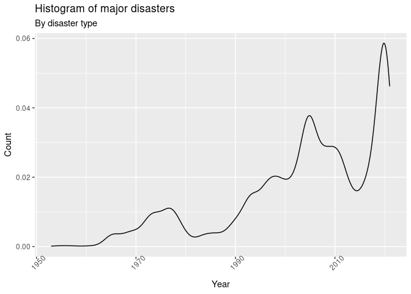
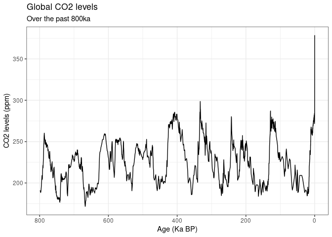
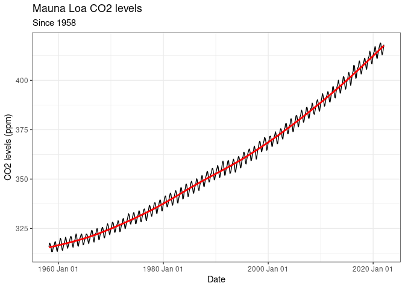

The World is Changing
================
by Team ACE

## Introduction

Climate change is an ever increasing concern for humanity as we continue
to rely on natural gas, oil, and other finite resources to power our
lives. Despite efforts to reduce personal carbon footprints and switch
to renewable sources of energy such as solar, wind, or hydroelectric,
greenhouse gas emissions are still rising worldwide. If we as a species
do not take action to switch from fossil fuels to sustainable sources of
energy, we risk losing more than we can handle, from the biodiversity of
many ecosystems to entire housing markets. The only way to reduce the
effects of climate change is to stop using fossil fuels soon, however
even though people are aware of climate change, facts alone will not
engage people to take action. As such, we have taken these facts and
turned them into more powerful figures to help people visualize the
damage done by climate change.

## Methodology

The data analyzed to make visualizations for this project came from a
variety of sources. The majority of which, including sea level rise,
city population density, and temperature came from Kaggle. All of the
data analyzed in this project were numerical data, with exceptions for
city names and disaster types, which were qualitative data. Datasets
were combined and cleaned to create data frames that were easy to work
with and create plots. For example, the US_Temp_Pop dataset combines US
city population data and temperature data over time to more easily
visualize how temperatures in cities with high populations are rising.
Using these datasets in combination with one another helped us answer
our initial question, “How does increasing global temperatures measured
by city predict the number of natural disasters in the same area?” This
was accomplished by making histogram plots of natural disasters, plots
of specific disasters such as wildfires per city, and creating a leaflet
mapping of wildfires throughout the United States.

Although natural disasters are striking and cause lots of acute damage
when they occur, rising sea levels also pose a more subtle threat. As
sea levels continue to rise in the long term, more and more habitats and
coastal communities become increasingly concerned with consistent
flooding and destruction of their property and ecosystems. For this
reason, we also included plots of rising sea levels globally. In
addition to the plot, we also created a linear regression model to
interpret the rate at which global sea level rise is occurring at. The
model also has the added benefit of being able to predict what the mean
sea level may look like in the near future based on past data. Finally,
we also analyzed global CO2 levels as an explanatory variable for the
increase in global temperature rise.

## Findings

The linear regression formulated from mean sea level rise reveals that
global mean sea levels are rising at approximately .318mm/year.. At this
current rate, coastal communities like Miami beaches could be completely
submerged by 2100( Castro, Alejandro). While this rate was formulated
based on current data, it is likely that this rate will increase in the
coming years as the rate of CO2 emissions is increasing exponentially.
This is evident both in our visualization of the Mauna Loa CO2 levels,
and also in our figure depicting the Global CO2 levels over the past 800
thousand years, in which we find a sharp spike in the CO2 levels in ppm
at the dawn of the industrial revolution.

In concordance with rising CO2 levels, there is also a linear increase
in the average temperature of cities in the US with a population over
one million. Higher temperatures increase risk to areas with drier
climates as periods of heat waves last longer. This in turn increases
the risk of drought in the area along with the probability of wildfires.
Our line plot showing the large wildfires per year from 1990-2015
portrays an increase concurrent with rising temperatures. Most
strikingly, the leaflet plot visualizing large wildfires across the US
outlines that wildfires are a much more serious concern on the west
coast and in Alaska compared to the east coast.

Between rising sea levels, increasing rates of wildfires, and higher CO2
levels in our atmosphere, it is clear that as we continue to rely on
fossil fuels to power our lives, we pay a higher price each day by
risking more frequent and catastrophic natural disasters.

## Presentation

Our presentation can be found [here](presentation/presentation.html).

## Data

<!-- Include a citation for your data here. -->
<!-- See http://libraryguides.vu.edu.au/c.php?g=386501&p=4347840 for guidance on proper citation for datasets. -->
<!-- If you got your data off the web, make sure to note the retrieval date. -->

US Temperature Data

File name: US_temps.csv

[Source](https://www.kaggle.com/berkeleyearth/climate-change-earth-surface-temperature-data)

US Disaster Data - File name: us_disaster_declarations.csv -
[Source](https://www.kaggle.com/headsortails/us-natural-disaster-declarations/version/72)

Wildfire Data - File name: FW_Veg_Rem_Combined.csv -
[Source](https://www.kaggle.com/capcloudcoder/us-wildfire-data-plus-other-attributes)

Sea Level Data - File name: sealevel.csv -
[Source](https://www.kaggle.com/kkhandekar/global-sea-level-1993-2021)

US city population density Data - File name: uscitypopdensity.csv -
[Source](https://www.kaggle.com/mmcgurr/us-city-population-densities)

Global CO2 data - File name: co2_data.csv -
[Source](https://keelingcurve.ucsd.edu/permissions-and-data-sources/)

## References

Castro, Alejandro. “Miami Underwater.” ArcGIS StoryMaps, Esri, 4
Dec. 2020,
<https://storymaps.arcgis.com/stories/80d2465cd19c405f933e9afcfe1fdf83>.

-   [Climate
    Image](https://climate.nasa.gov/solutions/adaptation-mitigation/)
-   [Water
    Scarcity](https://www.worldwildlife.org/threats/water-scarcity)
