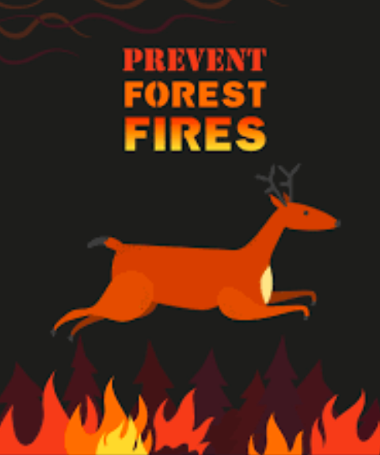
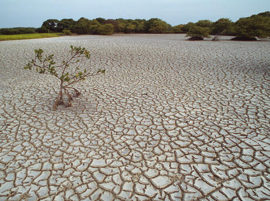

```{r load-packages, include = FALSE}
# Add any additional packages you need to this chunk
library(tidyverse)
library(tidymodels)
library(palmerpenguins)
library(knitr)
library(xaringanthemer)
library(broom)
library(leaflet) ## For leaflet interactive maps
library(sf) ## For spatial data
library(RColorBrewer) ## For color palettes
library(htmltools) ## For html
library(leafsync) ## For placing plots side by side
library(kableExtra) ## Table output
library(tidymodels) # modelling
library(readr)
```

```{r setup, include=FALSE}
# For better figure resolution
knitr::opts_chunk$set(fig.retina = 3, dpi = 300, fig.width = 6, fig.asp = 0.618, out.width = "100%", message = FALSE, warning = FALSE)
```

```{r xaringan-themer, include=FALSE, warning=FALSE}
style_mono_dark(
  base_color = "#cbf7ed",
  title_slide_text_color = "#000000",
  header_font_google = google_font("Josefin Sans"),
  text_font_google   = google_font("Montserrat", "300", "300i"),
  code_font_google   = google_font("Fira Mono")
  )
```


```{r load-data, include=FALSE}
disaster_data <- readr::read_csv(file = "../data/us_disaster_declarations.csv")
wildfires <- readr::read_csv(file = "../data/FW_Veg_Rem_Combined.csv")
US_temp <- readr::read_csv(file = "../data/US_temps.csv")
sea_lvl <- readr::read_csv(file = "../data/sealevel.csv")
US_pop <- readr::read_csv(file = "../data/uscitypopdensity.csv")
global_co2 <- readr::read_csv(file = "../data/co2_data.csv")
```

```{r, echo = FALSE}
style_xaringan(
  title_slide_background_image = "img/globe_image_map.jpeg",
  title_slide_text_color = "#000000",
  title_slide_background_color = "#595959",
  title_slide_background_size = "contain"
  )
```

class: center, middle

# How do the frequency and severity of natural disasters such as wildfires and rising sea level change over time?


```{r include=FALSE, echo = FALSE}
US_pop$Population_2016 <- US_pop$"2016 Population" # create a new column/variable
US_pop$"2016 Population" <- NULL # remove the column
US_temp_pop <- left_join(x = US_temp,
                         y = US_pop,
                         by = "City")
```

---
class: inverse
# Where does our Data come from?

.pull-left[
```{r dataset-image, echo = FALSE, out.height = 350, out.width = 460, fig.align = 'left', fig.alt="drastic climate changes across the landscape"}
knitr::include_graphics("img/climate.jpg")
```
]

.pull-right[

* Kaggle

* We combined data regarding: 
   - sea level
   - temperature
   - disaster size and frequency
   - population
   - geographic location
]

.footnote[image of multiple climates]
---


# Visualizing the Increase in Disasters Throughout the US


.pull-left[
```{r disaster-hist, fig.alt="Density plot of natural disasters. Shows increase from 1950 to present", echo=FALSE} 

 disaster_data %>% 
   filter(incident_type %in% c("Coastal Storm", "Drought", "Earthquake", "Fire", "Flood","Freezing", "Hurricane", "Mud/Landslide", "Severe Ice Storm","Severe Storm(s)", "Snow", "Tornado", "Tsunami", "Typhoon", 
 "Volcano")) %>% 
   ggplot(mapping = aes(x = fy_declared)) + 
     geom_histogram(binwidth = 10) + 
     #geom_density() + 
     facet_wrap( ~ incident_type) + 
     theme(axis.text.x = element_text(angle = 45)) + 
     labs(title = "Histogram of major disasters", 
          subtitle = "By disaster type", 
          x = "Year", 
          y = "Count") + 
   scale_color_viridis_c() 
```
]

.pull-right[
```{r linegraph of disasters, echo = FALSE, fig.alt="density plot of natural disasters since 1950. Shows significant increase"}
 disaster_data %>% #this graph is probably good to show on the side 
 ggplot(mapping = aes(x = fy_declared)) + 
   geom_density() + 
   theme(axis.text.x = element_text(angle = 45)) + 
   labs(title = "Linegraph of major disasters", 
        subtitle = "By disaster type", 
        x = "Year", 
        y = "Count") + 
   scale_color_viridis_c() 
``` 
]
---
class: inverse
# Average US Temperatures
```{r temp-large-cities, echo = FALSE, out.height=525, out.width=1800, fig.alt="faceted figure showing increasing temperatures in cities with over 1 million population since the 1700's"}
US_temp_pop %>%
  filter(Population_2016 >= 1000000) %>% # cities with over 1 million population
  select(dt, AverageTemperature, City, State, Population_2016) %>%
  ggplot(mapping = aes(x = dt,
                       y = AverageTemperature)) +
    geom_smooth() +
    labs(title = "Temperature in Large Cities in the US",
         subtitle = "Over the past sesquintennial, filtered for cities with pop > 1000000",
         x = "Year",
         y = "Average Temperature") +
    facet_wrap( ~ City)
```


---
class: inverse

# Number of Wildfires since 1992

.pull-left[

* Wildfire prevention:

  - have recently been funded
  - help to prevent high cost damage

* Number of Wildfires vs Acreage burned
]

.pull-right[
```{r large-wildfires, echo = FALSE, fig.alt="density plot showing increase in wildfires since 1990"}
lg_wildfires <- wildfires %>%
  filter(fire_size_class %in% c("D", "E", "F", "G"))
lg_wildfires %>%
  ggplot(mapping = aes(x = disc_pre_year,
                       y = fire_size)) +
    geom_smooth() +
    labs(title = "Large wildfires by year",
         subtitle = "Wildfires of class D, E, F, and G, size of 100 acres or more",
         x = "Year of wildfire",
         y = "Wildfire size (acres)")
```
]


---
class: inverse, center, middle

# How has the global sea level increased?
.pull-left[ 
* Sea level has continued to increase at faster rates.

* In concordance with increasing CO2 levels
]

.pull-right[ 
```{r sea level rise cleaning, echo = FALSE}
sea_lvl <- sea_lvl %>%
  group_by(Year) %>%
  mutate(avg_GMSL_per_year = mean(GMSL_GIA))
```

```{r sea level rise mapping, echo = FALSE, fig.alt="increasing non-linear model of sea level rise from 1993 to 2012"}  
ggplot(data = sea_lvl,
       mapping = aes(x = Year,
                     y = GMSL_noGIA)) +
  geom_point() +
  geom_line(aes(y = avg_GMSL_per_year, color = "#edf8b1")) +
  geom_point(aes(y = avg_GMSL_per_year, color = "yellow")) +
  geom_smooth() +
  labs(title = "Global mean sea level rise",
       subtitle = "Relative to 2006",
       x = "Year",
       y = "Global Mean Sea Level (mm)") +
  scale_color_viridis_d()

```
]


--- 


---

class: inverse
--- 

# Linear modelling and Global Mean Sea level rise and US temperature and Population 

.pull-left[  

```{r linear-regression-modeling-on-SLR, echo=FALSE}  
US_temp_pop <- US_temp_pop %>%  
    filter(Population_2016 >= 1000000)

m1 <- linear_reg() %>% # Select Model Type  
      set_engine("lm") %>% # Set engine  
      fit(AverageTemperature ~ City, data = US_temp_pop) #code kept crashing so switched to sea_lvl instead  


m2 <- linear_reg() %>% # Select Model Type  
        set_engine("lm") %>% # Set engine  
        fit(GMSL_GIA ~ Year, data = sea_lvl)  
```  

* A linear model helps us predict mean global sea level  

* GMSL_GIA = (2.833)year - 5679.441mm

* Adjusted R-squared value  = `r round(glance(m2)[2]$adj.r.squared, 3)`

]  
 
.pull-right[
```{r sea-level-regression-mapping, echo=FALSE, fig.alt="increasing linear model of sea level rise from 1993 to 2012"}  
  sea_lvl %>%  
  ggplot(aes(x = Year, y = GMSL_GIA)) +  
    geom_point(alpha = 0.4) +  
    geom_smooth(method = "lm", se = FALSE) +  
    geom_line(aes(y = avg_GMSL_per_year)) +  
    labs(title = "Yearly Increase in global mean sea level rise",  
        subtitle = "A linear model",  
        x = "Year",  
        y = "Global Mean Sea Level")  
```  
]


---
class: inverse, center, middle

# Leaflet Mapping of Large WildFires in the US

```{r, echo = FALSE}
US_temp_pop <- US_temp_pop %>%
  mutate(Latitude = str_remove_all(Latitude, "[NESW]"),
         Longitude = str_remove_all(Longitude, "[NESW]"))
US_temp_pop$Longitude <- as.numeric(US_temp_pop$Longitude)
US_temp_pop$Latitude <- as.numeric(US_temp_pop$Latitude)
US_temp_pop <- US_temp_pop %>%
  mutate(Longitude = Longitude * -1)
```


```{r wildfires-by-size, echo = FALSE, fig.alt="Leaflet map showing locations, size, class, and cause across the US"}
wf_pal <- colorFactor(palette = "YlOrRd", domain = lg_wildfires$fire_size_class)

  leaflet(data = lg_wildfires) %>%
  addTiles() %>%
  setView(lng = -97,
          lat = 39,
          zoom = 4) %>%
  addCircles(lng = ~lg_wildfires$longitude,
             lat = ~lg_wildfires$latitude,
             #label = ~lg_wildfires$stat_cause_descr,
             #radius = ~lg_wildfires$wf_rad_mi,
             color = wf_pal(lg_wildfires$fire_size_class),
             stroke = FALSE,
             fillOpacity = 0.7,
             #clusterOptions = markerClusterOptions()
             )
```

---
class: inverse, center, middle

# What we can do to prevent Wildfires:
.pull-left[

- Practice proper fire safety

- Reduce your carbon footprint

- Vote on climate action 
]

.pull-right[
```{r dataset-image-wildfire, echo = FALSE, out.height = 350, out.width = 350, fig.align = 'left', fig.alt="cartoon deer jumping across a flame"}

```
]
.footnote[
maine wildfire prevention poster
]
---
class: inverse

# Global CO2 levels and Increasing Temperature
.pull-left[
```{r recent_co2, fig.alt="Mauna Loa CO2 levels (ppm) of last 60 years. Shows seasonal variability and distinct exponential increase.", echo = FALSE}

global_co2 %>%
  mutate(Date = as.Date(Date)) %>%
ggplot(mapping = aes(x = Date, y = co2_ppm)) +
  geom_line() +
  geom_smooth(color = "red", se = FALSE) +
  theme_bw() +
  scale_x_date(date_labels = "%Y %b %d") +
  labs(title = "Mauna Loa CO2 levels",
       subtitle = "Since 1958",
       x = "Date",
       y = "CO2 levels (ppm)")
```
]

.pull-right[
* Distinct increase in CO2 over last 60 years.
* Seasonal variability is shown by non-smooth curve
* Today's CO2 level: 418.64 ppm
]


---
class: inverse, center, middle

# CO2 level increase over the past 800 thousand years: The Keeling Curve

.pull-left[
```{r global_co2, fig.alt="Global CO2 levels (ppm) of last 800 thousand years from ice cores. Big spike at onset of industrial revolution and still rising today.", echo = FALSE}
global_co2 %>%
  mutate(ageKa = Age_yrBP/1000) %>%
ggplot(mapping = aes(x = ageKa, y = CO2_ppm)) +
  geom_line() +
  scale_x_reverse() +
  theme_bw() +
   labs(title = "Global CO2 levels",
      subtitle = "Over the past 800ka",
      x = "Age (Ka BP)",
      y = "CO2 levels (ppm)")
```
]

.pull-right[
* Earth has historically been below 275 ppm
* Since the industrial revolution we are now by far at the highest CO2 level(ppm) in Earth's history
* This cyclic sawtooth pattern is due to the rapid warming and slow cooling of the earth caused by Milankovitch cycles (orbital forcings)
]

---
class: inverse, center, middle

# Sociological Impacts 
.pull-left[
1. People Displaced:
   - Many coastal communities will be underwater by 2100 (Castro, Alejandro)
   
2. Food Insecurity:
   - flooding of farms results in lower crop yield
   
3. Fresh water scarcity:
   - affected weather cycle leads to unreliable water cycles
]

.pull-right[
```{r dataset-image-water, echo = FALSE, out.height = 343, out.width = 460, fig.align = 'left', fig.alt="dry wasteland with no water"}

```
]
.footnote[water scarcity leads to barren soil]

---
class: inverse, center, middle

# Future Work 
What efforts are being made by organizations?
What individual efforts can we make?

---
class: inverse, center, middle

# Thank you and Questions

<!-- ??? -->
<!-- <p align="center"> -->
<!--   <iframe src="https://dcs-210.github.io/w2022-project-mia-luke-sadie/presentation/heatmap3.gif" width="1016" height="516" frameBorder="0"></iframe> -->
<!-- </p> -->