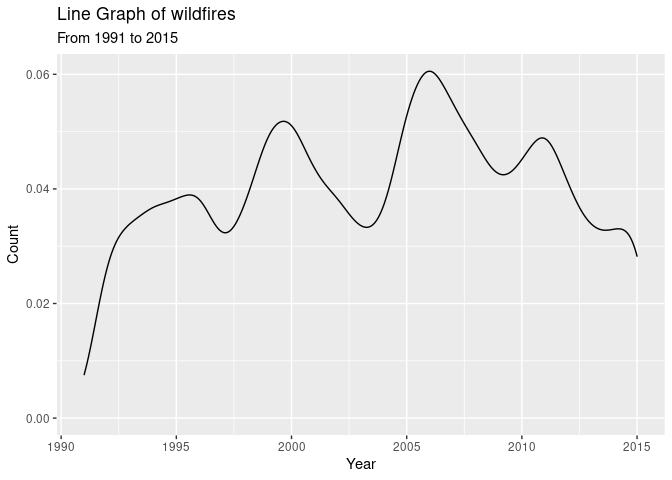
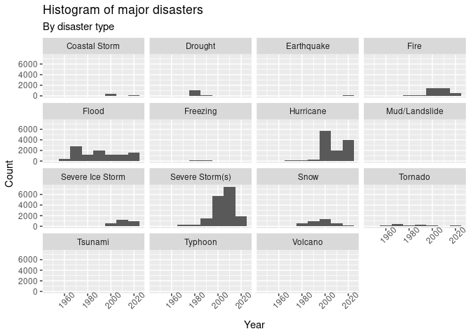

Project proposal
================
Team ACE

``` r
library(tidyverse)
library(broom)
```

## 1. Introduction

Our research question is “How does increasing global temperatures
measured by city predict the number of natural disasters in the same
area?” Our data for global temperatures by city was found using kaggle’s
climate change database. Our data ranges from 1750 to 2015, and has 32
columns representing variables with information regarding min, max, and
average land temperature.

Our sub topics include:

1.  Global temp and wildfires
2.  Global temp and droughts
3.  Global temp and flooding
4.  Global temp and hurricanes

``` r
disaster_data <- readr::read_csv(file = "../data/us_disaster_declarations.csv")
glimpse(disaster_data)
```

    ## Rows: 62,547
    ## Columns: 22
    ## $ fema_declaration_string    <chr> "DR-1-GA", "DR-2-TX", "DR-3-LA", "DR-4-MI",…
    ## $ disaster_number            <dbl> 1, 2, 3, 4, 5, 6, 7, 8, 9, 11, 12, 13, 14, …
    ## $ state                      <chr> "GA", "TX", "LA", "MI", "MT", "MI", "MA", "…
    ## $ declaration_type           <chr> "DR", "DR", "DR", "DR", "DR", "DR", "DR", "…
    ## $ declaration_date           <dttm> 1953-05-02, 1953-05-15, 1953-05-29, 1953-0…
    ## $ fy_declared                <dbl> 1953, 1953, 1953, 1953, 1953, 1953, 1953, 1…
    ## $ incident_type              <chr> "Tornado", "Tornado", "Flood", "Tornado", "…
    ## $ declaration_title          <chr> "Tornado", "Tornado & Heavy Rainfall", "Flo…
    ## $ ih_program_declared        <dbl> 0, 0, 0, 0, 0, 0, 0, 0, 0, 0, 0, 0, 0, 0, 0…
    ## $ ia_program_declared        <dbl> 1, 1, 1, 1, 1, 1, 1, 1, 1, 1, 1, 1, 1, 1, 1…
    ## $ pa_program_declared        <dbl> 1, 1, 1, 1, 1, 1, 1, 1, 1, 1, 1, 1, 1, 1, 1…
    ## $ hm_program_declared        <dbl> 1, 1, 1, 1, 1, 1, 1, 1, 1, 1, 1, 1, 1, 1, 1…
    ## $ incident_begin_date        <dttm> 1953-05-02, 1953-05-15, 1953-05-29, 1953-0…
    ## $ incident_end_date          <dttm> 1953-05-02, 1953-05-15, 1953-05-29, 1953-0…
    ## $ disaster_closeout_date     <dttm> 1954-06-01, 1958-01-01, 1960-02-01, 1956-0…
    ## $ fips                       <chr> "13000", "48000", "22000", "26000", "30000"…
    ## $ place_code                 <dbl> 0, 0, 0, 0, 0, 0, 0, 0, 0, 0, 0, 0, 0, 0, 0…
    ## $ designated_area            <chr> "Statewide", "Statewide", "Statewide", "Sta…
    ## $ declaration_request_number <dbl> 53013, 53003, 53005, 53004, 53006, 53007, 5…
    ## $ hash                       <chr> "bb121323c9c29d3bef0c9a3f134bfd8b5ecff148",…
    ## $ last_refresh               <dttm> 2021-07-13 23:01:19, 2021-07-13 23:01:19, …
    ## $ id                         <chr> "60c3b7a9a0ee349d71025780", "60c3b7a9a0ee34…

``` r
wildfires <- readr::read_csv(file = "../data/FW_Veg_Rem_Combined.csv")
glimpse(wildfires)
```

    ## Rows: 55,375
    ## Columns: 43

    ## Warning: One or more parsing issues, see `problems()` for details

    ## $ ...1             <chr> "0", "1", "2", "3", "4", "5", "6", "7", "8", "9", "10…
    ## $ `Unnamed: 0`     <dbl> 0, 1, 2, 3, 4, 5, 6, 7, 8, 9, 10, 11, 12, 13, 14, 15,…
    ## $ fire_name        <chr> NA, NA, NA, "WNA  1", NA, NA, NA, NA, NA, "CRAZY", NA…
    ## $ fire_size        <dbl> 10.0, 3.0, 60.0, 1.0, 2.0, 1.0, 5.2, 1.0, 1.0, 1.0, 8…
    ## $ fire_size_class  <chr> "C", "B", "C", "B", "B", "B", "B", "B", "B", "B", "B"…
    ## $ stat_cause_descr <chr> "Missing/Undefined", "Arson", "Arson", "Debris Burnin…
    ## $ latitude         <dbl> 18.10507, 35.03833, 34.94780, 39.64140, 30.70060, 32.…
    ## $ longitude        <dbl> -66.75304, -87.61000, -88.72250, -119.30830, -90.5914…
    ## $ state            <chr> "PR", "TN", "MS", "NV", "LA", "GA", "GA", "TX", "AR",…
    ## $ disc_clean_date  <chr> "2/11/2007", "12/11/2006", "2/29/2004", "6/6/2005", "…
    ## $ cont_clean_date  <chr> NA, NA, NA, "6/6/2005", NA, NA, NA, NA, NA, "4/19/200…
    ## $ discovery_month  <chr> "Feb", "Dec", "Feb", "Jun", "Sep", "Mar", "Jan", "Nov…
    ## $ disc_date_final  <chr> NA, NA, NA, "6/6/2005 2:14", NA, NA, NA, NA, NA, "4/1…
    ## $ cont_date_final  <chr> NA, NA, NA, "6/6/2005 18:00", NA, NA, NA, NA, NA, "4/…
    ## $ putout_time      <chr> NA, NA, NA, "0 days 00:00:00.000000000", NA, NA, NA, …
    ## $ disc_date_pre    <chr> "1/12/2007", "11/11/2006", "1/30/2004", "5/7/2005", "…
    ## $ disc_pre_year    <dbl> 2007, 2006, 2004, 2005, 1999, 1999, 2008, 2005, 2007,…
    ## $ disc_pre_month   <chr> "Jan", "Nov", "Jan", "May", "Aug", "Feb", "Dec", "Oct…
    ## $ wstation_usaf    <chr> "785140", "723235", "723235", "724880", "722312", "72…
    ## $ dstation_m       <dbl> 58917.70, 32665.34, 105122.15, 43433.33, 25940.57, 53…
    ## $ wstation_wban    <dbl> 11603, 13896, 13896, 23185, 3908, 366, 99999, 99999, …
    ## $ wstation_byear   <dbl> 1945, 1978, 1978, 1942, 1987, 1942, 2006, 1984, 1973,…
    ## $ wstation_eyear   <dbl> 2018, 2020, 2020, 2020, 2016, 2020, 2020, 2020, 2020,…
    ## $ Vegetation       <dbl> 12, 15, 16, 0, 12, 12, 12, 12, 15, 15, 12, 12, 16, 12…
    ## $ fire_mag         <dbl> 1.0, 0.1, 1.0, 0.1, 0.1, 0.1, 0.1, 0.1, 0.1, 0.1, 0.1…
    ## $ weather_file     <chr> "785140-11603-2007.gz", "723235-13896-2006.gz", "7232…
    ## $ Temp_pre_30      <dbl> 24.480974, 7.553433, 4.971930, 16.275967, -1.000000, …
    ## $ Temp_pre_15      <dbl> 24.716923, 7.010000, 5.782766, 18.996181, -1.000000, …
    ## $ Temp_pre_7       <dbl> 24.9025974, 0.3435294, 5.5587500, 18.1425641, -1.0000…
    ## $ Temp_cont        <dbl> 24.527961, 10.448298, 13.696600, 0.000000, -1.000000,…
    ## $ Wind_pre_30      <dbl> 4.341807, 2.709764, 3.364499, 4.054982, -1.000000, -1…
    ## $ Wind_pre_15      <dbl> 3.492857, 2.881707, 2.923830, 3.398329, -1.000000, -1…
    ## $ Wind_pre_7       <dbl> 3.262092, 1.976471, 2.695833, 3.671282, -1.000000, -1…
    ## $ Wind_cont        <dbl> 3.250413, 2.122320, 3.369050, 0.000000, -1.000000, -1…
    ## $ Hum_pre_30       <dbl> 78.21659, 70.84000, 75.53163, 44.77843, -1.00000, -1.…
    ## $ Hum_pre_15       <dbl> 76.79375, 65.85891, 75.86861, 37.14081, -1.00000, -1.…
    ## $ Hum_pre_7        <dbl> 76.38158, 55.50588, 76.81283, 35.35385, -1.00000, -1.…
    ## $ Hum_cont         <dbl> 78.72437, 81.68268, 65.06380, 0.00000, -1.00000, -1.0…
    ## $ Prec_pre_30      <dbl> 0.0, 59.8, 168.8, 10.4, -1.0, -1.0, 26.0, 28.4, 6.6, …
    ## $ Prec_pre_15      <dbl> 0.0, 8.4, 42.2, 7.2, -1.0, -1.0, 0.0, 27.5, 3.3, 1.8,…
    ## $ Prec_pre_7       <dbl> 0.0, 0.0, 18.1, 0.0, -1.0, -1.0, 0.0, 1.2, 0.0, 0.0, …
    ## $ Prec_cont        <dbl> 0.0, 86.8, 124.5, 0.0, -1.0, -1.0, 0.0, 55.4, 46.4, 0…
    ## $ remoteness       <dbl> 0.01792339, 0.18435495, 0.19454351, 0.48744745, 0.214…

``` r
US_temp <- readr::read_csv(file = "../data/US_temps.csv")
glimpse(US_temp)
```

    ## Rows: 687,289
    ## Columns: 7
    ## $ dt                            <date> 1820-01-01, 1820-02-01, 1820-03-01, 182…
    ## $ AverageTemperature            <dbl> 2.101, 6.926, 10.767, 17.989, 21.809, 25…
    ## $ AverageTemperatureUncertainty <dbl> 3.217, 2.853, 2.395, 2.202, 2.036, 2.008…
    ## $ City                          <chr> "Abilene", "Abilene", "Abilene", "Abilen…
    ## $ Country                       <chr> "United States", "United States", "Unite…
    ## $ Latitude                      <chr> "32.95N", "32.95N", "32.95N", "32.95N", …
    ## $ Longitude                     <chr> "100.53W", "100.53W", "100.53W", "100.53…

## 2. Data

Some of our data sources include: 1. Csv file from kaggle with global
temp by city 2. Csv file from kaggle with wildfire info 3. CSV file from
kaggle on US disaster declarations (includes info on floods and
hurricanes)

## 3. Data analysis plan

The first analysis we will do is to visualize how global temperatures
can be used as a predictor for the number of wildfires in a given year
within a specific area.

The first analysis we will do is to visualize how global temperatures
can be used as a predictor for the number of wildfires in a given year
within a specific area.

### STATISTICAL METHODS

Some statistical methods we should use in our project are linear
regressions to determine how correlated the two datasets are and some
statistical significance tests to see if our conclusions are reliable.

### RESULTS NEEDED

For our question to be answered, we would need a significantly
correlated dataset that would either show a positive association or
negative association between global temperature and wildfire
probability.

## Example of relevant graphs

``` r
ggplot(data = wildfires,
       mapping = aes(x = disc_pre_year)) + 
  geom_histogram(binwidth = 1) + 
  labs(title = "Histogram of wildfires",
       subtitle = "From 1991 to 2015",
       x = "Year",
       y = "Count")
```

    ## Warning: Removed 8 rows containing non-finite values (stat_bin).

<!-- -->

``` r
US_temp %>%
  filter(City == "San Francisco") %>%
    ggplot(mapping = aes(x = dt, 
                         y = AverageTemperature)) + 
    geom_smooth() + 
    labs(title = "Temperature in San Fransisco, Ca",
         subtitle = "Over the past sesquintennial",
         x = "Year",
         y = "Average Temperature")
```

    ## `geom_smooth()` using method = 'gam' and formula 'y ~ s(x, bs = "cs")'

<!-- -->

``` r
disaster_data %>%
  filter(incident_type %in% c("Coastal Storm", "Drought", "Earthquake", "Fire", "Flood",
                              "Freezing", "Hurricane", "Mud/Landslide", "Severe Ice Storm",
                              "Severe Storm(s)", "Snow", "Tornado", "Tsunami", "Typhoon",
                              "Volcano")) %>%
  ggplot(mapping = aes(x = fy_declared)) +
    geom_histogram(binwidth = 30) + 
    facet_wrap( ~ incident_type) +
    theme(axis.text.x = element_text(angle = 45))
```

<!-- -->
